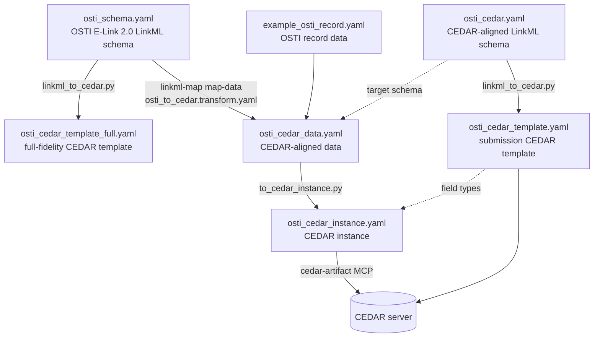

# OSTI → CEDAR: LinkML schema + linkml-map pipeline

This directory turns the **OSTI (E-Link 2.0) submission schema** — authored in
LinkML — into **CEDAR** metadata artifacts, and transforms OSTI record *data*
into **CEDAR instances** using [linkml-map](https://github.com/linkml/linkml-map).

It produces four things:

1. A **CEDAR-compatible template** generated from the OSTI LinkML schema
   (full-fidelity — every OSTI field — plus a submission-focused profile).
2. A **linkml-map transformation spec** that maps OSTI record data onto a
   CEDAR-aligned LinkML schema.
3. **Scripts** that generate the templates, run the transform, and wrap the
   result into an uploadable CEDAR instance.
4. This documentation.

---

## The pipeline



**Why a wrapper step (`to_cedar_instance.py`)?** A CEDAR *instance* is not a
plain LinkML data shape — every value is wrapped in an envelope: literals become
`{value: ...}`, IRI fields become `{id: ...}`, and nested elements become
`{children: {...}}`. So the clean split is: **linkml-map does the field-level
semantic mapping** (OSTI → CEDAR-aligned LinkML), and a small generic wrapper
puts on the CEDAR envelope, driven by the template's field types.

---

## Files

| Path | What it is |
|------|-----------|
| `schema/osti_schema.yaml` | The source OSTI (E-Link 2.0) LinkML schema (unmodified). |
| `schema/osti_cedar.yaml` | **CEDAR-aligned** LinkML schema (~39 fields): the fields real OSTI records actually populate — bibliographic, journal, conference, identifiers, people/orgs — flattened for CEDAR (one display name per person, single contact email, nested affiliations/award IDs). Internal E-Link bookkeeping is dropped. The `target_schema` of the transform. |
| `transform/osti_to_cedar.transform.yaml` | The **linkml-map** TransformationSpecification: `osti_schema` → `osti_cedar`. |
| `scripts/fetch_osti.py` | Fetch a record by OSTI ID (E-Link if token, else public API) and normalize it into `osti_schema` shape. |
| `scripts/linkml_to_cedar.py` | Generic LinkML-schema → CEDAR-template generator. |
| `scripts/enrich_terms.py` | Fill the `*_term` ontology fields via BioPortal best-match search. |
| `scripts/to_cedar_instance.py` | Wraps CEDAR-aligned data into a CEDAR instance. |
| `scripts/osti_to_cedar.sh` | **Full pipeline for one record**: fetch → transform → wrap. |
| `scripts/run_pipeline.sh` | Runs the transform on the bundled example (no fetch). |
| `data/example_osti_record.yaml` | Example OSTI record data (a real-ish LBNL/DOE dataset). |
| `output/osti_cedar_template_full.yaml` | **Full-fidelity** CEDAR template — all 126 OSTI fields, nested elements, enums as list fields. |
| `output/osti_cedar_template.yaml` | Submission CEDAR template (22 fields). |
| `output/osti_cedar_data.yaml` | linkml-map output (CEDAR-aligned data). |
| `output/osti_cedar_instance.yaml` | Final CEDAR instance, ready to upload. |

---

## Setup

```bash
cd work/osti-cedar
uv venv .venv && . .venv/bin/activate
uv pip install -r requirements.txt      # linkml + linkml-map
```

## Full pipeline: any OSTI record → CEDAR

Fetch a specific record by its OSTI ID, transform it, and produce an
upload-ready CEDAR instance in one command:

```bash
. .venv/bin/activate
export BIOPORTAL_API_KEY=...          # optional; enables ontology-term enrichment
scripts/osti_to_cedar.sh 3027336
#   [1/4] fetch    -> data/osti_3027336.yaml
#   [2/4] transform (linkml-map) -> output/osti_3027336_data.yaml
#   [3/4] enrich   ontology terms (BioPortal) -> fills *_term fields
#   [4/4] wrap     -> output/osti_3027336_instance.yaml   (ready to upload)
```

**Two fetch sources**, chosen automatically by `fetch_osti.py`:

- **E-Link 2.0 API** (`/elink2api/records/{id}`) — full structured record, but
  needs a bearer token that owns the record. Provide it via
  `$ELINK_BEARER_TOKEN`, `--token`, or a `../../elink_token` file. A token that
  can't read the record returns 403 and we fall back to source 2.
- **Public OSTI Data API** (`/api/v1/records/{id}`) — no auth, any public
  record, but a flatter/legacy shape. `fetch_osti.py` normalizes its legacy
  fields into the modern structured ones (`authors` → `persons`, parsing inline
  `[affiliation]` and `(ORCID:…)`; `sponsor_orgs`/`research_orgs` →
  `organizations`; contract numbers → `identifiers`), so the transform runs
  identically either way. Public records default `access_limitations` to `UNL`.

### Ontology-term enrichment

Some fields carry a string whose meaning is a known concept. For those, the
schema pairs the original field with a `*_term` **controlled-term** field, and
`enrich_terms.py` fills it with the best-match ontology term (across *any*
BioPortal ontology) as `{id, label}`:

| source field | term field | example |
|---|---|---|
| `product_type` | `product_type_term` | `DA` → *Dataset* (`MESH:D064886`) |
| `language` | `language_term` | `English` → *English* (SNOMEDCT) |
| `country_publication_code` | `country_term` | `US` → *United States* (`MESH:D014481`) |

Each `*_term` field is declared in `osti_cedar.yaml` with a `cedar_field_type:
controlled-term` annotation (plus an ontology for the CEDAR picker); the
generator renders it as a controlled-term field. A CEDAR controlled-term field
needs *some* ontology constraint to accept `{id, label}` values, but that
constraint only scopes the form's picker — instances may hold a best-match term
from a different ontology and still validate. Enrichment needs a BioPortal API
key (`--apikey`, `$BIOPORTAL_API_KEY`, or `--apikey-file`); without one the
`*_term` fields are simply left empty.

To add another enriched field: give its slot a `*_term` companion in
`osti_cedar.yaml` and add a row to `ENRICHMENTS` in `enrich_terms.py`.

### Upload to CEDAR

The final upload uses the **`cedar-artifact-rest` MCP** (it materializes the
compact instance into CEDAR JSON-LD server-side):

1. **Once**, upload the template — `create_template` on
   `output/osti_cedar_template.yaml`; note the returned `@id`.
2. Point instances at it: run with `CEDAR_TEMPLATE_IRI=<that @id>` (or pass
   `--is-based-on` to `to_cedar_instance.py`).
3. `create_instance` on `output/osti_<id>_instance.yaml`.

Worked example (uploaded live): template
`c1f7b035-6a29-4e56-b69d-fe946ffe5ee4`, with instances for OSTI `3027336`
(AmeriFlux switchgrass dataset) and `3364558` (a Green Chemistry article) —
one template, two record types.

## Run just the transform (bundled example, no fetch)

```bash
. .venv/bin/activate
bash scripts/run_pipeline.sh                       # uses data/example_osti_record.yaml
bash scripts/run_pipeline.sh path/to/your_records.yaml   # or your own OSTI data
```

Each step can also be run on its own:

```bash
# 1. Generate a CEDAR template from ANY LinkML schema + root class
python scripts/linkml_to_cedar.py schema/osti_schema.yaml --root-class Record \
  -o output/osti_cedar_template_full.yaml

# 2. Transform OSTI data -> CEDAR-aligned data
linkml-map map-data --unrestricted-eval \
  -T transform/osti_to_cedar.transform.yaml \
  -s schema/osti_schema.yaml --target-schema schema/osti_cedar.yaml \
  --source-type records -o output/osti_cedar_data.yaml \
  data/example_osti_record.yaml

# 3. Wrap into a CEDAR instance
python scripts/to_cedar_instance.py \
  --template output/osti_cedar_template.yaml \
  --data output/osti_cedar_data.yaml \
  -o output/osti_cedar_instance.yaml
```

---

## The generator: `linkml_to_cedar.py`

Walks a LinkML schema with `SchemaView` and emits the CEDAR compact template
form. Range → CEDAR field-type mapping:

| LinkML range | CEDAR field |
|--------------|-------------|
| `string` | `text-field` (or `text-area-field` for long/`maxLength > 500`) |
| `integer` | `numeric-field` (`xsd:int`) |
| `float` / `double` | `numeric-field` (`xsd:decimal`), with `minValue`/`maxValue` |
| `boolean` | `radio-field` (true/false) |
| `date` / `datetime` | `temporal-field` (`xsd:date` / `xsd:dateTime`) |
| `uri`, slot `*_url` / `url` | `link-field` |
| slot `orcid` / `doi` | `ext-orcid-field` / `ext-doi-field` |
| slot with `email` / `phone` | `email-field` / `phone-number-field` |
| **enum** range | `single-`/`multi-select-list-field` (values from the enum) |
| **class** range | `element` (recursively), `multivalued` → `multiple` |

A LinkML `^.{0,N}$` pattern is recognized as a `maxLength: N` constraint.

The full-fidelity template (`--root-class Record` on `osti_schema.yaml`)
preserves all 126 OSTI fields including the nested `persons → affiliations`,
`media → files`, `organizations → identifiers`, and `geolocations → points`
element trees, and every OSTI enum. Both generated templates validate against
the CEDAR model (`validate_schema_artifact`).

---

## The transform: `osti_to_cedar.transform.yaml`

A linkml-map `TransformationSpecification` mapping `osti_schema` → `osti_cedar`.
It demonstrates the useful transform patterns:

- **Passthrough** — `title`, `description`, `doi`, `keywords`, ... via `populated_from`.
- **Rename** — OSTI `subject_category_code` → CEDAR `subject_category_codes`.
- **Derive a value** — `osti_landing_url` is built from `osti_id`
  (`'https://www.osti.gov/biblio/' + str(osti_id)`).
- **Assemble** — a person's `name` from OSTI's `first_name` / `middle_name` /
  `last_name` parts.
- **Pick one from many** — a single contact `email` from OSTI's email list.
- **Nested objects** — `persons`, `organizations`, and their nested
  `affiliations` / `identifiers` are mapped via nested `class_derivations`.

### linkml-map gotchas learned here (worth knowing)

- **Enum-valued source slots** can't be `populated_from` directly onto a plain
  string target — linkml-map tries to *map the enum* and fails
  (`Could not find what to derive from a source <Enum>`). Read them through a
  bare-name `expr` instead (e.g. `product_type`, `type`, `relation`).
- **Expression dialect.** The default (restricted) evaluator binds each source
  slot as a **bare name** (`first_name`), *not* `src.first_name`, and uses
  simpleeval's `EvalWithCompoundTypes`: list/dict literals, indexing and
  comprehensions are fine, but **attribute access (`obj.attr`) is not**. Use
  bare names and, for nested objects, prefer nested `class_derivations` over
  drilling into proxy objects inside an expression.
- Run `map-data` with `--unrestricted-eval` and pass `--source-type records`
  (the root class) and `--target-schema` (needed for nested object derivations).

### The CEDAR-aligned profile (`osti_cedar.yaml`)

`osti_cedar.yaml` (~39 fields) is a **coverage-driven profile**, not a 1:1 copy
of all 126 OSTI fields. Its field set was chosen by surveying ~100 live public
OSTI records and keeping what they actually populate: identity/dates, DOI and
full-text URLs, language, journal metadata (name/type/ISSN/publisher/volume/
issue), conference and report fields, `doe_funded_flag`, keywords/subjects, and
the nested people / organizations / identifiers / related-identifiers. It drops
OSTI's internal/readonly E-Link bookkeeping (`added_by*`, `edited_by*`,
`date_released_*`, `audit_logs`, `workflow_status`, ...) that a submitter never
provides. To carry *every* remaining field, add the slot to `osti_cedar.yaml`
and a `slot_derivation` to the transform — the full-fidelity template
(`osti_cedar_template_full.yaml`) shows the complete 126-field set.

---

## Uploading to CEDAR

Using the `cedar-artifact-rest` MCP (or the CEDAR Workbench):

1. Upload `output/osti_cedar_template.yaml` (or `_full`) → CEDAR assigns it a
   server `@id`.
2. Set that `@id` as `isBasedOn` when wrapping the instance:
   `python scripts/to_cedar_instance.py ... --is-based-on <TEMPLATE_IRI>`.
3. Upload `output/osti_cedar_instance.yaml`.

Validate at any point with the `cedar-artifact` MCP:
`validate_schema_artifact` (templates) and `validate_instance_artifact`
(instances). The generated template and the example instance both validate. ✔
